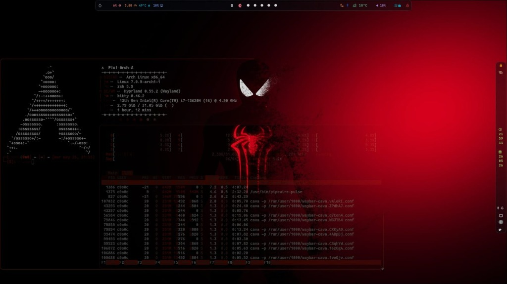

<div align="center">

# Pixi-Arch-A

### Un entorno de escritorio de cristal esmerilado impulsado por Arch Linux y Hyprland


<p align="center">
  
  <br>
  <sub><b>Pixi-Arch-A — Súper Glass & Carmesí Oscuro</b></sub>
</p>

</div>

> [!IMPORTANT]
> **Pixi-Arch-A** es una evolución y ramificación personalizada de alto rendimiento pensada para ofrecer una estética fuera de lo común. Combina la velocidad de **Arch Linux** con el dinamismo del compositor **Hyprland**, sobre un diseño de **Cristal Esmerilado (Frosted Glassmorphism)** coherente, con tonos oscuros e iluminación carmesí.
>
> Este proyecto ha sido desarrollado y refinado por su creador con el apoyo de su asistente de IA **Antigravity**, con el objetivo de ofrecer una experiencia hispanohablante fluida y una propuesta visual cuidada al detalle.

---

## Índice

- [Características principales](#características-principales)
- [Stack tecnológico](#stack-tecnológico)
- [Compatibilidad y requisitos del sistema](#compatibilidad-y-requisitos-del-sistema)
- [Instalación](#instalación)
- [Actualización](#actualización)
- [Atajos de teclado y uso](#atajos-de-teclado-y-uso)
- [Bloqueo e inactividad](#bloqueo-e-inactividad)
- [Optimización y modo de juego](#optimización-y-modo-de-juego)
- [Créditos](#créditos)

---

## Características principales

- 🪟 **Glassmorphism coherente** — translucidez y desenfoque aplicados de forma consistente en barra, lanzador, terminales y notificaciones.
- 🎨 **Ciclador de temas Dark Glass** — un clic en el botón de paleta () de la barra superior regenera todo el sistema de color con **Wallust**, de forma automática y cohesiva.
- 🌐 **Instalador 100% en español** — instalación interactiva, guiada y desatendida, sin curva de aprendizaje.
- 🔒 **Bloqueo de sesión inteligente** — aviso e inactividad gestionados centralmente, con `hyprlock` como protector de pantalla.
- 🎮 **Modo de juego integrado** — libera VRAM y CPU desactivando animaciones y efectos con un solo atajo.
- 🧹 **Optimización de sistema incluida** — un script dedicado limpia caché, huérfanos y logs para mantener el equipo ligero.

> [!TIP]
> **Pixi-Arch-A** está diseñado 100% en modo oscuro. Olvídate de fondos claros: cada wallpaper aleatorio genera automáticamente su propia paleta de cristal translúcido.

---

## Stack tecnológico

| Tecnología | Propósito |
|---|---|
| **Arch Linux** | Distribución base |
| **Hyprland** | Compositor Wayland (ventanas, animaciones) |
| **Waybar** | Barra superior/inferior |
| **Rofi** | Lanzador de aplicaciones / menús |
| **Kitty / Ghostty / WezTerm** | Terminales (soporta múltiples) |
| **Wallust** | Generación de paletas de colores desde el wallpaper |
| **Swaync** | Notificaciones |
| **Wlogout** | Menú de cierre de sesión |
| **AGS (Aylur's GTK Shell)** | Widgets GTK personalizados |
| **QuickShell** | Widgets/QML |
| **Btop** | Monitor del sistema |
| **Cava** | Visualizador de audio |
| **Fastfetch** | Info del sistema |
| **SDDM** | Display manager |
| **PipeWire** | Audio |
| **Zsh + Oh My Zsh** | Shell |
| **Kvantum / qt5ct / qt6ct** | Temas Qt |
| **Swappy** | Screenshots |
| **Nautilus / Thunar** | Gestores de archivos |
| **Yay / Paru** | AUR helpers |

---

## Compatibilidad y requisitos del sistema

Para garantizar una experiencia fluida con las animaciones de cristal esmerilado, ten en cuenta lo siguiente:

**Distribuciones compatibles**
- ✅ **Principal:** Arch Linux (instalación base o `archinstall`)
- ✅ **Derivados de Arch:** EndeavourOS, ArcoLinux, CachyOS, Garuda Linux — se recomienda una instalación mínima/limpia para evitar conflictos con entornos preexistentes
- ❌ **No compatible:** Debian, Ubuntu, Fedora, Linux Mint, o cualquier distribución no basada en pacman/Arch

**Hardware recomendado**

| Componente | Recomendación |
|---|---|
| **GPU AMD Radeon** | Muy recomendado — soporte nativo y perfecto con Wayland/Hyprland |
| **GPU Intel** | Totalmente compatible y fluido de forma nativa |
| **GPU Nvidia** | Compatible mediante controladores propietarios; el instalador detecta la GPU y aplica parches/variables de entorno automáticamente (experiencia variable según el modelo) |
| **Almacenamiento** | SSD o NVMe altamente recomendado, para cargas instantáneas y caché de imágenes |
| **RAM** | Mínimo 4 GB — se recomiendan **8 GB o más** para multitarea con transparencia/blur sin cuellos de botella |

---

## Instalación

Instalación completamente automática en un solo bloque:

```bash
cd ~
rm -rf Pixi-Arch-A
git clone https://github.com/0o0-ct/Pixi-Arch-A.git
cd Pixi-Arch-A
chmod +x install.sh
./install.sh
```

<details>
<summary><b>Ver los pasos en detalle</b></summary>

**1. Clonar el repositorio**

Usa HTTPS para descargar el proyecto de forma segura y rápida, sin necesidad de llaves SSH:

```bash
git clone https://github.com/0o0-ct/Pixi-Arch-A.git ~/Pixi-Arch-A
```

**2. Acceder al directorio**

```bash
cd ~/Pixi-Arch-A
```

**3. Dar permisos de ejecución al script**

```bash
chmod +x install.sh
```

**4. Ejecutar el instalador**

Inicia el instalador oficial, interactivo y en español, y sigue las instrucciones en pantalla:

```bash
./install.sh
```

</details>

---

## Actualización

Si ya tienes el sistema instalado y quieres aplicar las últimas mejoras, parches y personalizaciones:

```bash
# 1. Acceder al directorio del proyecto
cd ~/Pixi-Arch-A

# 2. Traer los últimos cambios desde el repositorio
git pull origin main

# 3. Volver a ejecutar el instalador para aplicar las actualizaciones
./install.sh
```

> [!TIP]
> El instalador detecta automáticamente los paquetes ya instalados y solo aplica los nuevos perfiles y configuraciones estéticas, de forma segura.

---

## Atajos de teclado y uso

| Atajo | Acción |
|---|---|
| `SUPER + L` | Bloquea la pantalla al instante, con desenfoque e información en tiempo real (`hyprlock` + `hypridle`) |
| `SUPER + D` | Abre el lanzador Rofi, con estética de cristal esmerilado adaptada a la paleta del wallpaper |
| `SUPER + Enter` | Abre una terminal Kitty translúcida |
| `CTRL + SUPER + Espacio` | Alterna el idioma del teclado (Español por defecto / Inglés) |
| `SUPER + SHIFT + G` | Activa o desactiva el Modo de Juego |

Alternar la paleta del logo de Fastfetch en la terminal:

```bash
~/.config/fastfetch/toggle-color-gradient.py
```

---

## Bloqueo e inactividad

Toda la gestión de inactividad de la pantalla se centraliza en `hypridle.conf`:

- **Aviso de inactividad** — a los **9 minutos** (`timeout = 540`) recibirás una notificación en el sistema.
- **Bloqueo de seguridad** — a los **10 minutos** (`timeout = 600`) la sesión se bloquea automáticamente mediante `loginctl lock-session`, que activa el protector de pantalla seguro `hyprlock`.

---

## Optimización y modo de juego

**Script de optimización del sistema**

Limpia cachés, elimina paquetes huérfanos, borra logs y optimiza la gestión de RAM:

```bash
bash ~/.config/hypr/scripts/system-optimize.sh
```

**Modo de juego (GameMode)**

- Alterna con **`SUPER + SHIFT + G`** (o desde el menú de configuraciones rápidas). Desactiva animaciones, sombras y fondo animado para liberar VRAM y CPU.
- **GPU Nvidia dedicada en portátiles híbridos:** añade `prime-run %command%` en las opciones de lanzamiento de Steam o Lutris.
- **Feral GameMode:** para títulos exigentes, usa `gamemoderun %command%` y forzar CPU/GPU a máxima frecuencia.

---

<div align="center">

## Créditos

> [!NOTE]
> Este proyecto es un *fork* y una personalización profunda basada en el excelente instalador y dotfiles de **JaKooLit** ([Arch-Hyprland](https://github.com/JaKooLit/Arch-Hyprland)). Gracias por la base sólida, la arquitectura del script y la inspiración original que hicieron posible este entorno de escritorio.

</div>
